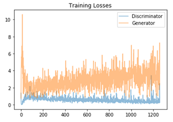

# DeepLearning_NanoDegree
Project overview for deep learning nano degree from Udacity.
For further details please feel free to have a look into the project folders.

--- 
## Fully connected networks: Bike sharing predictor
Project to implement a fully conncted net without external frameworks like Pytorch or Tensorflow.
This includes both forward and backwards pass of the network.

Architecture visualized:


With this architecture the following results were archived on the bike sharing dataset:


--- 
## Convolutional neural networks

### Dog breed classifier: Custom network architecture
Project task to design a custom CNN for the dog breed classification and achieve a accuracy greater than 10%.
My approach features 4 convolutional layers with 3x3 kernels and max pooling with stride 2 after each convolution.
The final classifier vector contains 133 values for the 133 dog breed classes.
The final accuracy was 12%.

```
Net(
  (conv1): Conv2d(3, 32, kernel_size=(3, 3), stride=(2, 2), padding=(1, 1))
  (conv2): Conv2d(32, 64, kernel_size=(3, 3), stride=(1, 1), padding=(1, 1))
  (conv3): Conv2d(64, 128, kernel_size=(3, 3), stride=(1, 1), padding=(1, 1))
  (conv4): Conv2d(128, 256, kernel_size=(3, 3), stride=(1, 1), padding=(1, 1))
  (pools2): MaxPool2d(kernel_size=3, stride=2, padding=0, dilation=1, ceil_mode=False)
  (linear): Linear(in_features=12544, out_features=133, bias=True)
  (dropout): Dropout(p=0.3)
)
```
Architecture visualized:


### Dog breed classifier: Transfer learning
The second task was creating the classifier via transfer learning.
As reference model I choose [ResNet-50](https://arxiv.org/pdf/1512.03385.pdf)
Added a linear layer with 133 outputs as final classifier.
Without further data augmentation this resulted in a accuracy of 67% on the test set.

Some classification results of the final app:


### Style transfer with VGG
During the chapter I implemented a CNN which uses style transfer to blend 2 different images into one.
The network learns to only extract the style from on of the pictures and to keep to content in the other one.
Here is a result on a photo from myself in Las Vegas with the style of the artist Hundertwasser:


--- 
## Reccurent neural network: TV script generation
Implement a recurrent neural network with Long short-term memory to create new tv scripts.
Architechture of my implementation looks like this:

```
RNN(
  (embedding): Embedding(21384, 150)
  (lstm): LSTM(150, 250, num_layers=2, batch_first=True, dropout=0.5)
  (dropout): Dropout(p=0.3)
  (fc): Linear(in_features=250, out_features=21384, bias=True)
)
```

Some newly invented tv scripts by the RNN can be found in the corresponding sub-folder.
--- 
## Generative adverserial network (GAN): Face generation
Project to implement a GAN with generator and discriminator for face generation based on the [CelebA](http://mmlab.ie.cuhk.edu.hk/projects/CelebA.html) dataset.
Training process after 35 epochs:



Here are some faces the network generated:


--- 

## AWS Sagemaker deployment: IMDB sentiment analysis
Project to deploy a sentiment analysis model by using AWS Sagemaker and REST api.
The result was a deployed ML endpoint integrated into a intuitive website by using Lambda functions and the AWS API gateway.


--- 
